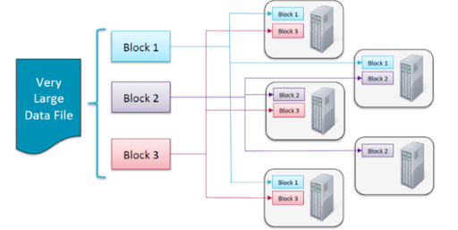
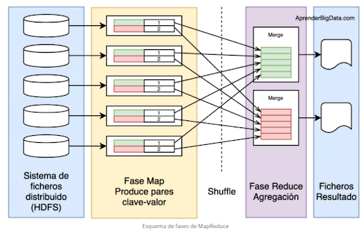
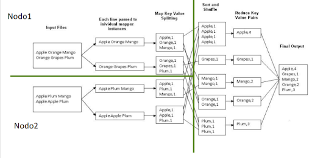

# Hadoop
Tradicionalmente se trabajaba en máquinas individuales. Sin embargo, a medida que el tiempo pasa la cantidad de datos va siendo cada vez mayor por lo que se crean cuellos de botella en las máquinas. De ahí surje una nueva forma de trabajar con Big Data; Hadoop. 

## Deficición
Hadoop es un framework de código abierto para almacenar datos y ejecutar aplicaciones en clusters.

## Introducción
### Historia
Inspirado en los documentos de Google para MapReduce y GFS (Google File System) y actualmente es un proyecto de alto nivel de Apache.
Las principales distribuciones de Apache Hadoop son:
- Cloudera
- Hortonworks
- MapR

### Características 
1. En Hadoop se distribuyen los datos nada más llegan al Cluster y los nodos se deben comunicar entre sí lo menos posible. Además, los datos se replican (normalmente factor 3) para obtener **disponibilidad, fiabilidad y tolerancia a fallos**. 

3. Cada ejecución de MapReduce se denomida job y estos deben de ejecutarse de manera independiente en en cluster. Es decir, la salida de un job no debe condicionar la salida de otro job a no ser que sea estrictamente necesario. El rendimiento de un job se puede ver afectar potr la ejecución de otro job ya que la potencia del Cluster es finita, pero eso ya se tiene en cuenta. 

5. Tipos de datos soportados en Hadoop:
- Estructurados
- Semi-estructurados 
- No estructurados

6. Tiempo de procesado:
- Originalmente procesado por lotes (programa que no necesita iteracción del usuario)
- Near Real Time: los datos se procesan con una diferencia de a tiempo real
- Real Time: los datos se procesan a tiempo real con latencia mínima

7. Tipo de procesado:
- Ejecución en paralelo
- Sobre datos distribuidos (**HDFS**)

### Nociones bácicas
Un Cluster se compone de un conjunto de servidores (nodos) que trabajan juntos para conseguir un objetivo común. Hay 2 tipo de nodos:
- Maestros --> gobiernan el cluster
- Escalvos --> procesan y almacenan la información

Cada nodo tiene sus Demonios corriendo. *Siendo un demonio un programa que se encarga de procesos del sistema en segundo plano y al que no puede acceder el usuario directamente*

### Componentes de Hadoop
- HDFS
  - Almacena los datos en el cluster
- MapReduce
  - Procesa los datos en el cluster
- Ecosistema de herramientas
  - Conjunto de herramientas que hacen más fácil trabajar con Hadoop

## HDFS 
### Definición
Es un sistema de archivos nativo de Google escrito en Java el cual está desplegado sobre el sistema de archivos nativo de cada servidor. 

### Características 
Su característica más importante es que **provee de almacenamiento redundante de grandes volúmenes de datos transparente al usuario** --> El usuario no tiene que indicar que quiere replicar la información almacenada

### Funcionamiento 
Está pensado para escribir una sola vez, pero leer muchas. Es preferible borrar el archivo y copiarlo de nuevo antes que modificarlo. Además, es óptimo cuando trabaja con cantidad moderada de datos ya que funciona mejor con millones de datos antes que con billones. 

HDFS está pensado para leer óptimamente archivos de gran tamaño no para lecturas aleatorias --> **DUDA**

#### Funcionamiento 1
Cada archivo se divide en bloques entre los nodos del cluster en un tiempo igual al tiempo de escritura replicandóse cada nodo un total de 3 (por defecto aunque modificable) veces. 

#### Funcionamiento 2
**ESTO NO LO ENTIENDO BIEN**

### Demonios 
Como se ha mencionado en las nociones básicas, un demonio es un programa que se encarga de procesos del sistema en segundo plano y al que no puede acceder el usuario directamente. Es decir, es un programa especial que se ejecuta en segundo plano en vez de ser controlado directamente por el usuario.
Los demonios que se ejecutan en los nodos Maestro y Esclavo son diferentes.

#### Nodo Mestro
- NameNode
  
  Se encarga de:
  
  El almacenamiento y gestión de los metadatos de los permisos y usuarios
  
  Los bloques que componen cada archivo y dónde está cada uno
  
  Arrancar un fichero llamado *fsimage* que al arrancarlo los metadatos son guardados en disco y cargado en memoria
  
  Guardar los cambios en un fichero llamado *edits* almacenado en memoria. 
 
- Secondary NameNode
  
  Realiza las labores de mantenimiento de *fsimage* y *edits*
  
- Standby NameNode
  
  Este demonio es para arquitecturas con Alta Disponiblidad --> garantizar la continuidad de los servicios ante desperfectos (ataques, corte de energía). Esto se consigue habiendo varios nodos maestros en espera en distintas sedes situadas en lugares diferentes (demonio Standby NameNode).
  
  Realiza las labores de mantenimiento de *fsimage* y *edits*
  
  Toma automáticamente el relevo en caso de fallo
  
#### Nodos Esclavos
- DataNode
  
  Los nodos almacenan los bloques, no información de los mismos
  
  Se encarga de acceder a los bloques
  
  Cada nodo esclavo se encarga de hacer una copia hasta llegar al factor de replicación
  
  Gestionan las Tasks que componen un Job
  

#### Checkpoint del Secondary NameNode
Cada hora o cada millón de transacciones el SNN (**No sé qué es**) realiza el checkpoint de los metadatos. Pasos:
1. LLama al NameNode para obtener el fichero edits
2. Obtiene el fichero edits y fsimage del NameNode
3. Carga el fichero fsimage en memoeria y agrega los cambios del fichero edits
4. Crea el nuevo fsimage consolidado
5. Envía el nuevo fichero el NameNode 
6. El NameNode reemplaza el antiguo fsimage por el nuevo

### Lecturas y escrituras
#### Escritura
1. El cliente conecta con el NameNode
2. 2. El NameNode busca en sus metadatos *fsimage* y devuelve el nombre de los bloques y lista de los DataNodes donde se va a escribir la nueva infromación
3. El cliente conecta con el primer DataNode de la lista y empieza el envío de los datos
4. Se conecta con el segundo DataNode para realizar el envío y lo mismo con el tercero (replicación 3)
5. Finaliza el envío a los DataNodes
6. El cliente indica al NamdeNode dónde se ha realizado la escritura

### Comandos
 - Copiar un fichero de disco local a HDFS --> **$ hadoop fs -put /.../foo.txt /.../foo.txt**
 - Listar el directorio Home del usuario --> **$ hadoop fs -ls**
 - Listar el directorio root del usuario --> **hadoop fs –ls/**
 - Mostrar el conteido de un fichero --> **hadoop fs -cat /user/fred/bar.txt**
 - Copiar un fichero de HDFS al local --> **$ hadoop fs -get /user/fred/bar.txt baz.txt**
 - Crear un directorio en el home de HDFS del usuario llamdo input --> **$ hadoop fs -mkdir input**
 - Borrar un directorio y todo su contenido --> **$ hadoop fs -rm -r input_old**

## MapReduce
### Definición 
Es un paradigma de programación caracterizado por dividirse en 3 etapas: **Map, Suffle&Sort y Reduce**. Estos subprocesos se ejecutan de manera distribuida en diferentes nodos de procesamiento o esclavos. Este procesamiento se apoya en tecnologías de almacenamiento de datos distribuidos, en Hadoop es HDFS, el cual se encarga de almacenar la información dividida en bloques que luego MapReduce juntará para obtener los resultados.

### Características
Es tolerante a fallos

Paraleliza las tareas y las distribuye por el cluster

Está pensado para que sea una abstracción de los programadores, estos solo tienen que definir el Mapper, el Reducer y el Driver. En función de si los bloques con filas de una tabla o palabras sueltas, el Mapper y el Reducer serán diferentes. 

**MapReduce permite subdividir tareas complejas en un conjunto de otras más simples y ejecutarlas en paralelo (contando palabras)**

### Proceso
#### Fase Map 
Se ejecuta en subtareas llamadas mappers los cuales son los encargados de generar pares clave-valor filtrando, agrupando, ordenando o transformando los datos originales. El mapper actúa sobre cada registro de entrada y cada ejecución opera sobre un único bloque HDFS, si es posible. 
#### Fase Suffle&Sort
Puede nos ser necesaria. Ordena la salida de la Fase Map (un par clave/valor) por clave para la siguiente fase. 
#### Fase Reduce
Agrega los valores producidos por la fase 1 o por la fase 2 en caso de ser necesaria en función de la clave para generar  un fichero de salida escrito en HDFS. 

#### Visualmente

- Ejemplo general

- Contando palabras

### Demonios
#### JobTracker
**Hay un solo demonio por cluster**. Este demonio corre en el o los nodos **Maestro** y se dedica a gestionar los jobs (*una ejecución de MapReduce*) y distribuye las Task (*ejecución de un solo Map o Reduce*) entre los TaskTrackers (demonios de los nodos esclavos)

#### TaskTracker
Hay un demonio en TasTracker en cada nodo esclavo y se dedica a ejecutar y monitorizar cada Task Map y Reduce. 

## Ecosistema Hadoop
### Introducción
Hadoop por sí solo no sería suficiente como entorno de trabajo ya que hay muuchos profesionales que no están acostumbrados a trabajar en entornos tecnológicos puros. Por ello existen una serie de frameworks que permiten trabajar con el marco de trabajo (framework) de Hadoop.
- Hive
- Pic
- Sqoop
- Flume
- Kafka
- 

