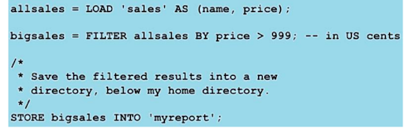

# Hadoop
Tradicionalmente se trabajaba en máquinas individuales. Sin embargo, a medida que el tiempo pasa la cantidad de datos va siendo cada vez mayor por lo que se crean cuellos de botella en las máquinas. De ahí surje una nueva forma de trabajar con Big Data; Hadoop. 

## Deficición
Hadoop es un framework de código abierto para almacenar datos y ejecutar aplicaciones en clusters.

## Introducción
### Historia
Inspirado en los documentos de Google para MapReduce y GFS (Google File System) y actualmente es un proyecto de alto nivel de Apache.
Las principales distribuciones de Apache Hadoop son:
- Cloudera
- Hortonworks
- MapR

### Características 
1. En Hadoop se distribuyen los datos nada más llegan al Cluster y los nodos se deben comunicar entre sí lo menos posible. Además, los datos se replican (normalmente factor 3) para obtener **disponibilidad, fiabilidad y tolerancia a fallos**. 

3. Cada ejecución de MapReduce se denomida job y estos deben de ejecutarse de manera independiente en en cluster. Es decir, la salida de un job no debe condicionar la salida de otro job a no ser que sea estrictamente necesario. El rendimiento de un job se puede ver afectar potr la ejecución de otro job ya que la potencia del Cluster es finita, pero eso ya se tiene en cuenta. 

5. Tipos de datos soportados en Hadoop:
- Estructurados
- Semi-estructurados 
- No estructurados

6. Tiempo de procesado:
- Originalmente procesado por lotes (programa que no necesita iteracción del usuario)
- Near Real Time: los datos se procesan con una diferencia de a tiempo real
- Real Time: los datos se procesan a tiempo real con latencia mínima

7. Tipo de procesado:
- Ejecución en paralelo
- Sobre datos distribuidos (**HDFS**)

### Nociones bácicas
Un Cluster se compone de un conjunto de servidores (nodos) que trabajan juntos para conseguir un objetivo común. Hay 2 tipo de nodos:
- Maestros --> gobiernan el cluster
- Escalvos --> procesan y almacenan la información

Cada nodo tiene sus Demonios corriendo. *Siendo un demonio un programa que se encarga de procesos del sistema en segundo plano y al que no puede acceder el usuario directamente*

### Componentes de Hadoop
- HDFS
  - Almacena los datos en el cluster
- MapReduce
  - Procesa los datos en el cluster
- Ecosistema de herramientas
  - Conjunto de herramientas que hacen más fácil trabajar con Hadoop

## HDFS 
### Definición
Es un sistema de archivos nativo de Google escrito en Java el cual está desplegado sobre el sistema de archivos nativo de cada servidor. 

### Características 
Su característica más importante es que **provee de almacenamiento redundante de grandes volúmenes de datos transparente al usuario** --> El usuario no tiene que indicar que quiere replicar la información almacenada

### Funcionamiento 
Está pensado para escribir una sola vez, pero leer muchas. Es preferible borrar el archivo y copiarlo de nuevo antes que modificarlo. Además, es óptimo cuando trabaja con cantidad moderada de datos ya que funciona mejor con millones de datos antes que con billones. 

HDFS está pensado para leer óptimamente archivos de gran tamaño no para lecturas aleatorias --> **DUDA**

#### Funcionamiento 1
Cada archivo se divide en bloques entre los nodos del cluster en un tiempo igual al tiempo de escritura replicandóse cada nodo un total de 3 (por defecto aunque modificable) veces. 

#### Funcionamiento 2
**ESTO NO LO ENTIENDO BIEN**

### Demonios 
Como se ha mencionado en las nociones básicas, un demonio es un programa que se encarga de procesos del sistema en segundo plano y al que no puede acceder el usuario directamente. Es decir, es un programa especial que se ejecuta en segundo plano en vez de ser controlado directamente por el usuario.
Los demonios que se ejecutan en los nodos Maestro y Esclavo son diferentes.

#### Nodo Mestro
- NameNode
  
  Se encarga de:
  
  El almacenamiento y gestión de los metadatos de los permisos y usuarios
  
  Los bloques que componen cada archivo y dónde está cada uno
  
  Arrancar un fichero llamado *fsimage* que al arrancarlo los metadatos son guardados en disco y cargado en memoria
  
  Guardar los cambios en un fichero llamado *edits* almacenado en memoria. 
 
- Secondary NameNode
  
  Realiza las labores de mantenimiento de *fsimage* y *edits*
  
- Standby NameNode
  
  Este demonio es para arquitecturas con Alta Disponiblidad --> garantizar la continuidad de los servicios ante desperfectos (ataques, corte de energía). Esto se consigue habiendo varios nodos maestros en espera en distintas sedes situadas en lugares diferentes (demonio Standby NameNode).
  
  Realiza las labores de mantenimiento de *fsimage* y *edits*
  
  Toma automáticamente el relevo en caso de fallo
  
#### Nodos Esclavos
- DataNode
  
  Los nodos almacenan los bloques, no información de los mismos
  
  Se encarga de acceder a los bloques
  
  Cada nodo esclavo se encarga de hacer una copia hasta llegar al factor de replicación
  
  Gestionan las Tasks que componen un Job
  

#### Checkpoint del Secondary NameNode
Cada hora o cada millón de transacciones el SNN (**No sé qué es**) realiza el checkpoint de los metadatos. Pasos:
1. LLama al NameNode para obtener el fichero edits
2. Obtiene el fichero edits y fsimage del NameNode
3. Carga el fichero fsimage en memoeria y agrega los cambios del fichero edits
4. Crea el nuevo fsimage consolidado
5. Envía el nuevo fichero el NameNode 
6. El NameNode reemplaza el antiguo fsimage por el nuevo

### Lecturas y escrituras
#### Escritura
1. El cliente conecta con el NameNode
2. 2. El NameNode busca en sus metadatos *fsimage* y devuelve el nombre de los bloques donde hay hueco y lista de los DataNodes donde se va a escribir la nueva información
3. El cliente conecta con el primer DataNode de la lista y empieza el envío de los datos
4. Se conecta con el segundo DataNode para realizar el envío y lo mismo con el tercero (replicación 3)
5. Finaliza el envío a los DataNodes
6. El cliente indica al NamdeNode dónde se ha realizado la escritura

#### Lectura
1. El cliente conecta con el NameNode
2. El NameNode devuelve una lista de los DataNode que contienen ese bloque
3. El cliente conecta con el primer DataNode y comeinza la lectura del bloque

### Fiabilidad y recuperación
Los DataNode envían señales al NameNode cada 3 segundos. Si pasado un tiempo (por defecto 5 segudos) el NameNode no recibe información de alguno de los nodos, se da el nodo por perdido y **los demás DataNodes** distribuyen los bloques que contenía entre los demás DataNodes para mantener el factor de replicación.

Si este nodo se recupera, el sistema automáticamente decidirá qué bloques eliminar para mantener el factor de replicación de los bloques. 

Si el Maestro detecta que un Esclavo (DataNode) está ejecutando las Tasks más lento de lo normal, se envía la misma Task a otro nodo. El primero que acabe entrega el resultado y los procesos del más lento se matan. 

### Comandos
 - Copiar un fichero de disco local a HDFS --> **$ hadoop fs -put /.../foo.txt /.../foo.txt**
 - Listar el directorio Home del usuario --> **$ hadoop fs -ls**
 - Listar el directorio root del usuario --> **hadoop fs –ls/**
 - Mostrar el conteido de un fichero --> **hadoop fs -cat /user/fred/bar.txt**
 - Copiar un fichero de HDFS al local --> **$ hadoop fs -get /user/fred/bar.txt baz.txt**
 - Crear un directorio en el home de HDFS del usuario llamdo input --> **$ hadoop fs -mkdir input**
 - Borrar un directorio y todo su contenido --> **$ hadoop fs -rm -r input_old**

## MapReduce
### Definición 
Es un paradigma de programación caracterizado por dividirse en 3 etapas: **Map, Suffle&Sort y Reduce**. Estos subprocesos se ejecutan de manera distribuida en diferentes nodos de procesamiento o esclavos. Este procesamiento se apoya en tecnologías de almacenamiento de datos distribuidos, en Hadoop es HDFS, el cual se encarga de almacenar la información dividida en bloques que luego MapReduce juntará para obtener los resultados.

### Características
Es tolerante a fallos

Paraleliza las tareas y las distribuye por el cluster

Está pensado para que sea una abstracción de los programadores, estos solo tienen que definir el Mapper, el Reducer y el Driver. En función de si los bloques con filas de una tabla o palabras sueltas, el Mapper y el Reducer serán diferentes. 

**MapReduce permite subdividir tareas complejas en un conjunto de otras más simples y ejecutarlas en paralelo (contando palabras)**

### Proceso
#### Fase Map 
Se ejecuta en subtareas llamadas mappers los cuales son los encargados de generar pares clave-valor filtrando, agrupando, ordenando o transformando los datos originales. El mapper actúa sobre cada registro de entrada y cada ejecución opera sobre un único bloque HDFS, si es posible. 
#### Fase Suffle&Sort
Puede nos ser necesaria. Ordena la salida de la Fase Map (un par clave/valor) por clave para la siguiente fase. 
#### Fase Reduce
Agrega los valores producidos por la fase 1 o por la fase 2 en caso de ser necesaria en función de la clave para generar  un fichero de salida escrito en HDFS. 

#### Visualmente

- Ejemplo general

- Contando palabras

### Demonios
#### Demonios de MapReduce V1
##### JobTracker
**Hay un solo demonio por cluster**. Este demonio corre en el o los nodos **Maestro** y se dedica a gestionar los jobs (*una ejecución de MapReduce*) y distribuye las Task (*ejecución de un solo Map o Reduce, una tarea*) entre los TaskTrackers (demonios de los nodos esclavos)

##### TaskTracker
Hay un demonio en TasTracker en cada nodo esclavo y se dedica a ejecutar y monitorizar cada Task Map y Reduce. 

#### Demonios de MapReduce V2-Yarn
Estos demonios se encargan de reducir la carga de trabajo del JobTracker ya que este se encarga de todo en la Versión V1. Es como contratar encargados para que el jefe se pueda encargar de cosas de mayor índole. 

##### Resource Manager
Solo hay 1 por cluster y se encarga de arrancar el AplicationMasters y dota de recursos (CPU, RAM) a los nodos esclavos

##### AplicationMasters
Hay uno por job, tiene que pedir recursos y se encarga de gestionar cada task map y reduce en el conjunto de nodos en los que se está ejecutando las tareas asociadas al job

##### Node Manager
Hay uno por cada nodo esclavo y se encarga de gestionar las tareas asociadas al job

##### Containers
Es el conjunto de recursos cedidos por el ResourceManager tras una petición

##### JobHistory
Hay uno por cluster y almacena las métricas de los jobs y los metadatos.

### Localización
#### Localidad del dato
Cuando es posible, un Map Task se ejecuta en el nodo donde el bloque está localizado. Si esto no es posible, la Map Task se trae el bloque donde están los datos al nodo en el que se está ejecutando a través de la red.
Esto sucede cuando el nodo donde está el bloque está sobrecargado y merece la pena perder un poco de tiempo moviendo el bloque a través de la red.

#### Datos intermedios
Son los que se generan en la fase Shuffle&Sort y se almacenan en disco local, no es HDFS. Estos se borran luego de que el job haya termiando completamente.

#### Reducers
Sus datos no se procesan en el nodo donde se encuentra el Reducer sino que es el propio cluster el que decide en qué nodos se van a ejecutar los Reducers. La fase de S&S (Suffle&Sort) genera gran cantidad de movimiento en la red ya que la información tiene que llegar a los reducers para que se procede y se produzca la salida, la cual se escribe en HDFS.

#### Suffle&Sort
La fase S&S pued empezar antes de que acabe el Mapper ya que este va enviando la información nada más se va procesando y se ejecutaen S&S de forma paralalela. Sin embargo, el Reducer no puede comenzar hasta que el Suffle&Sort haya termiando. 

### Detalle del proceso
En la primera fase, el Mapper, los datos son divididos en Splits (cada split de tamaño de un bloque), tantos como sea necesario y cada uno de ellos es procesado por un Map. Una vez procesados por el Reducer, los datos son almacenados en disco local a la espera de ser enviados al Reducer. Al iniciarse la tarea de transferencia de datos intermedios al Reducer, se realiza la tarea de S&S donde los datos son ordenados por clave. Luego, se procesan los datos en el Reducer y por cada Reducer se genera un fichero de datos almacenado en HDFS. Los datos en cada Reducer están ordenados por clave, pero el no hay un orden en el conjunto de datos de todos los Reducers. Si queremos conseguir un orden total utilizamos un solo Reducer o bien *Partioners*.

### Código WordCount
#### Driver
El Driver es el encargado de configurar el MapReduce job para que se ejecute en Hadoop. Se especifica el nombre del job, el tipo de datos de entrada/salida, y los nombres de las clases del Mapper y Reducer. 

##### Imports necesarios
**import org.apache.hadoop.fs.Path;**
**import org.apache.hadoop.io.IntWritable;**
**import org.apache.hadoop.io.Text;**
**import org.apache.hadoop.mapreduce.lib.input.FileInputFormat;**
**import org.apache.hadoop.mapreduce.lib.input.FileOutputFormat;**
**import org.apache.hadoop.mapreduce.Job;**

##### Método Main
**public static void main(String[] args) throws Exception {**

Acepta 2 argumentos:
- Directorio de input
- Directorio de output

**if (args.length != 2) {**

    **System.out.printf("Usage: WordCount <input dir> <output dir>\n";**
    
    **System.exit(-1);**
    
**}**
  
Lo primero que hace el método main es asegurarse de que se han pasado estos dos argumentos. Sino, da error y para la ejecución. 
  
##### Configuración del Job
El job es el proceso MapReduce que se quiere llevar a cabo. El objeto Job permite establecer el Mapper y el Reducer especificando una clase en él.
1. Creamos el Job
  **Job job = new Job();
  job.setJarByClass(WordCount.class);**
  
2. Le damos nombre
   **job.setJobName("Word Count");**
4. Especificamos los directorios de entrada y salida
   **FileInputFormat.setInputPaths(job, new Path(args[0]));
     FileOutputFormat.setOutputPaths(job, new Path(args[1]));**
6. g
7. Nombre de las clases que representa el Mapper y el Reducer

#### Mapper
#### Reducer

## Ecosistema Hadoop
### Introducción
Hadoop por sí solo no sería suficiente como entorno de trabajo ya que hay muuchos profesionales que no están acostumbrados a trabajar en entornos tecnológicos puros. Por ello existen una serie de frameworks que permiten trabajar con el marco de trabajo (framework) de Hadoop.

### Herramientas
**- Hive**

    Es un software para interrogar/consultar datos escritos en HDFS que permite trabajar condatasets son un lenguaje similar al SQL, llamado HQL. Básicamente, se dedica a traducir Queries HQL a MapReduce. 
    
    
**- Pig**

    Es una plataforma para analizar grandes datasets almacenados en HDFS que presenta un lenguaje propio semejante a HQL llamado Pig Latin. También transforma consultas de PigLatin a MapReduce.
    
    

**- Sqoop**
    
    Se dedica principalemte a traer datos desde las BBDD relacionales a HDFS utilizando una parte de configuración más otra de SQL.
    
    

**- Flume**
    
    Fue diseñada para importar datos en un cluster en tiempo real desde distintos orígenes de datos a BBDD relacionales. 
Consta de 3 partes que hay que configurar dependiendo de lo que queramos obtener:
  - Source
  - Channel
  - Sink

    
    
**- Kafka**
  Proporciona una plataforma unificada de alto rendimiento y de baja latencia para la manipulación de funetes de datos a tiempo real.
  Arquitectura de Kafka
  
  

**- Bases de datos No-SQL**
    No-SQL significa "Not Only SQL", es decir, no se usa por defecto SQL para hacer las consultas. Ejemplos:
  - Cassandra --> JSON
  - MongoDB
  - Neo4j --> Grafos
  - Hbase

### Planificación cluster Hadoop
No veo de gran utilidad ponerlo en los apuntes.

# Ecosistema
## Hive
### Descripción
Es una estructura de almacenaje y consulta de datos de grandes volúmenes de datos mediante un lenguaje llamado **HiveQL (o HQL)** basado en SQL. Estas consultas se traducen de HQL a MapReduce y ejecutarse en Hadoop. 

### Niveles 
- Bases de datos
  Espacio de nombres que agrupa tablas y otras unidades de datos
- Tablas
  Unidades de datos homogéneas que comparten un mismo esquema
- Particiones
  Cada tabla puede tener una o más claves de particionado que determinan cómo se almacenan los datos
- Buckets (o Clusters)
  Las partiones a su vez se dividen en *buckets*
  
### Tipos de datos
#### Numéricos
- TINYINT
- SMALLINT
- INT
- BIGINT
- FLOAT
- DOUBLE
- DECIMAL

#### Fecha y hora
#### Complejos
PONER TABLA DE ESTO. INTERESANTE

### Operadores
#### Relacionales
#### Aritméticos
#### Otros

### Bases de datos
CREATE DATABASE nombre; --> Crear una base de datos
USE nombre; --> Cambiar de base de datos
DROP DATABASE nombre; --> Borrar una base de datos

### Creación de tablas  
  
Tablas en Word
  

### RLIKE y REGEX SerDe: Expresiones regulares Java
tabla diapo 38
A veces hay datos que no tienen delimitadores específicos o claros. Al leer la linea es dificil saber qué parte es cada variable por lo que necesitamos expresiones regulares. 

CREATE TABLE nombre(
    var1  STRING,
    var2  STRING,
    var3  STRING,
    var4  STRING)
 ROE FORMAT SERDE '... lo que vaya aquí'
 WITH SERDEPROPERTIES ("input.regex" = EXPRESIÓN REGULAR QUE SEPARE LA FILA EN VARIABLES);

### ORDER BY y SORT BY
Order by hace un orden total y se envían todos los resultados a un solo reducer mientras que Sort by realiza un orden local en cada reducer. 

### DISTRIBUTE BY con SORT BY
Controla cómo la salida del map se divide entre los reducers. Esto es utilizado por Hive cuando convierte las consultas a MapReduce. Asegura que las filas que tenegan en mismo valor en cierto campo vayan al mismo reducer

### Casting
Cambiar el formato de de una variable a otro diferente. 

### UNION ALL 
Une el resultado de 2 o más subconsultas para mostrarlo por pantalla. Todas las consultas deben devolver el mismo número de consultas. 

### VIEW
Cuando una consulta se vuelve demasiado complicada se utilizan **vistas** para reducir la compejidad de la misma. 

## Impala 
### Descripción
Es un motor SQL de elevado rendimiento pensado para operar con grandes volúmenes de datos que corre sobre clusters Hadoop y puede ejecutar Queries tanto en HDFS como en Hbase.

### Características
Ejecuta las Queries directamente sobre un cluster en lugar de ejecutar MapReduce para procesar. **Es unas 5 veces más rápido** que Hive o Pig aunque puede ser hasta 20 veces más rápido.

### Ventajas
Es más efectivo que programar en MapReduce ya que programar en SQL ocupa menos espacio que programar en Java. Es soportado por PowerBI y además es extensible mediante Java para abarcar otras herramientas.

### Comparativa Impala con Hive
#### Similitudes
- Ambas usan variantes de SQL
- Comparten el mismo **metastore** en el cluster
- Operan sobre tablas en HDFS y metadatos en el Metastore

#### Diferencias
Hive soporta, pero Impala no:
- Tipo DATE
- Funciones XML y JSON
- Sampling
- Vistas laterales
- Múltiples cláusulas DISTINCT por query

# Seguir############################################################################

## Pig
### Conceptos básicos
- Un *field* es un elemento , un atributo de la base de datos
- Una *collection* de valores es llamado *tuple*, que es el formado por los *fields* del mismo infividuo
- Una *collection* de *tuples* es un *bag*

La relación es una bag con un nombre asignado 

### Sintaxis básica
Pig Latin es un lenguaje de flujo de datos representado por una secuencia de instrucciones
Ejemplo

### Carga y almacenamiento de datos
#### Carga
La función por defecto para la carga de datos se denomina PigStorage la cual está implícita en la intrucción LOAD y por defecto asume que el texto está separado por comas.

allsales = LOAD 'sales' AS (name, price);
Aquí se estácargando el fichero en la variable 'sales' y asigna nombres a las columnas aunque esto no es obligatorio.
allsales = LOAD 'sales';

Se puede indicar el delimitador de las columnas como argumento de PigStorage
allsales = LOAD 'sales-csv' USING PigStorage(',') AS (name, price);

#### Almacenamiento de datos
DUMP --> muestra la salida por pantalla
STORE --> envía los resultados al disco (HDFS)

DUMP result; -- siendo result un identificador

### Tipos de datos
Pig trata a los tipos no identificados como *bytearray*.

| Tipo | Ejemplo |
| ------------- | ------------- |
| int  | 2013  |
| long  | 5,34,12L  |
| float  | 2013  |
| double  | 3,1415  |
| boolean*  | true  |
| datetime*  | 2013-05-30T14:52:39.000-04:00  |
| charray  |  Alice  |
| bytearray  | N/A  |

Se puede especificar el tipo de datos:
allsales = LOAD 'sales' AS (name:charray, price:int);

Los datos inválidos Pig los trata como NULL
hasprices = FILTER Records BY price IS NOT NULL;

### Filtrado y ordenación de los datos
bigsales = FILTER allsales By price > 3000;
bigsales = FILTER allsales BY name == 'Dieter' OR (price > 3500 AND price < 4000);

#### Comparación de registros 
Con el operador ==
alices = FILTER allasales BY name == 'Alice';

Con expresiones regulares con MATCHES
a_names = FILTER allsales BY name MATCHES 'A.*';

#### Selección y generación de campos
Podemos generar nuevas columnas con FOREACH y GENERATE
t = FOREACH allsales GENERATE price * 0.07;
t = FOREACH allsales GENERATE price * 0.07 AS tax;
t = FOREACH allsales GENERATE price * 0.07 AS tax:float;

#### Eliminación y ordenación de resultados
El comando DISTINCT elimina los registros duplicados de una *bag* (tabla). Básicamente para que el distinct se aplique, debe haber 2 filas con los mismos campos en todos sus atributos. 
unique = DISTINCT all_alices

### Funciones básicas
ROUND(), UPPER(), RANDOM(), SUBSTRING()

## Sqoop
### Descripción
Es una herramienta para transferir datos entre RDBMs y Hadoop y se utiliza para datos que están almacenados en Bases de Datos Relacionales que queremos mover a Hadoop para aprovechar toda su potencia. 

### Aspectos importantes
Sqoop importa datos de sde RDBMs a HDFS de varias formas:
- Transfiere una sola tabla
- Transfiere todas las tablas en BBDD
- Transfiere partes de una tabla (soporta la cláusula WHERE)

**Para importar los datos utiliza MapReduce** por lo que los ficheros se guardan con extensión \*.0\*. El primer import importa todas las filas de una tabla y el resto solo las filas creadas desde la última importación. 

